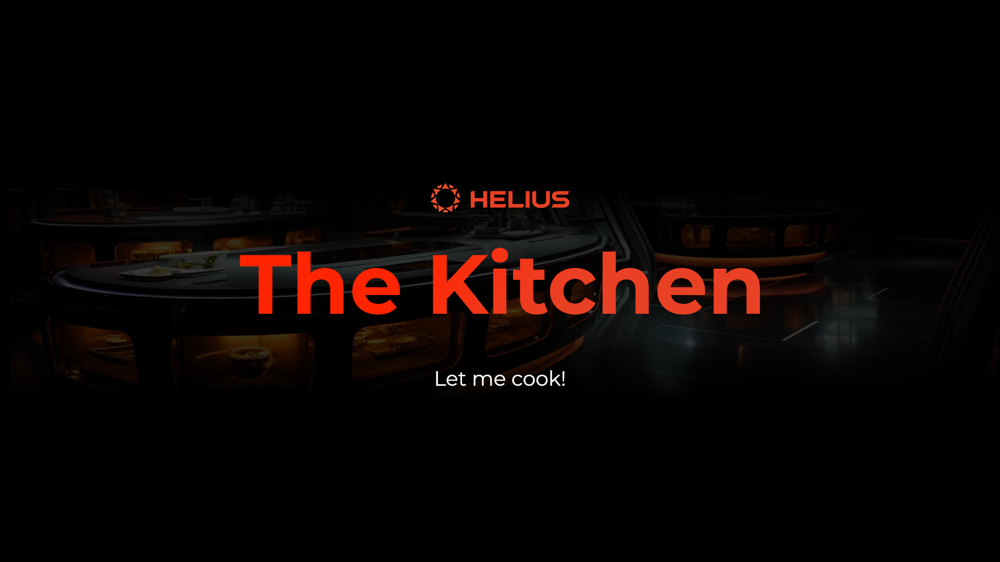

## The Kitchen: Compressed NFT Mint Site
Welcome to The Kitchen, an open-source platform that allows creators to set up a collection mint flow with compression. Dive into our well-organized codebase and set up your collection in no time.


### Project Structure
1. `/components/forms`: Contains forms for submitting collection creation and minting.
2. `/view`s: Displays the collection view, mint view, and home view.
3. `/utils`: Offers a collection of reusable tools for forms and more.
4. `/app.tsx`: The main base of the application.
5. `.env`: Contains the RPC API KEY and URLs for mainnet and devnet.


### Setting Up
Clone the Repository
```bash
git clone <repository-url>
```
Install Dependencies

Navigate to the root directory of the project:
```bash
cd the-kitchen
```
And install the required packages:
```bash
npm install
```
### Configuration

Update the .env file with your RPC API KEY and the relevant URLs for mainnet and devnet.

### Run the Project
```bash
npm run start
This will start the development server, and you should be able to access the application at http://localhost:3000.
```

### Contributing
We welcome contributions from everyone! If you'd like to contribute:

Fork the Repository: Click on the 'Fork' button at the top right of this page.

1. Clone Your Forked Repository:

```bash
git clone <your-forked-repository-url>
```
2. Create a New Branch:

```bash
git checkout -b your-new-branch-name
```
### Make Your Changes: Implement your changes and improvements.
1. Commit and Push Your Changes:
```bash
git add .
git commit -m "Your commit message"
git push origin your-new-branch-name
```
Submit a Pull Request (PR): Go to your forked repository on GitHub and click on the 'New Pull Request' button. Ensure you are making the PR to the dev branch of the main repository.

#### In your PR description, please include:

1. What was changed
2. How was this tested
## License
This project is licensed under the MIT License. See the LICENSE file for more details